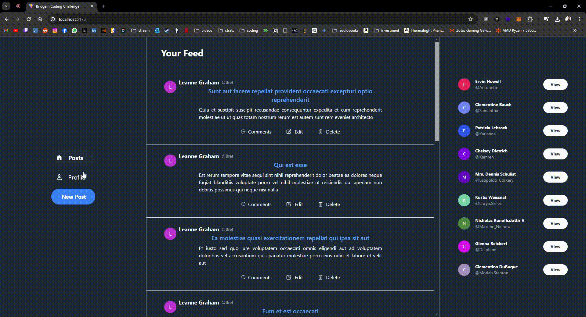
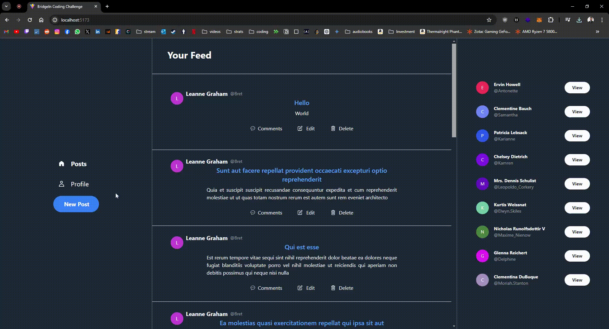
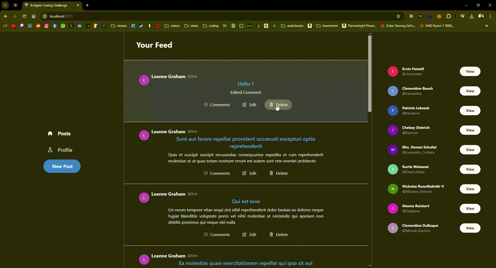
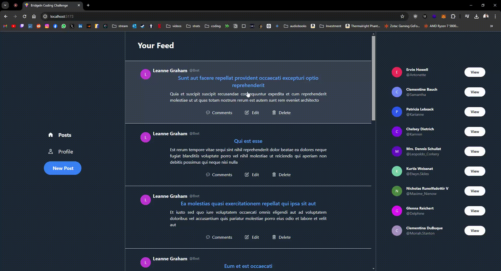

# BridgeIn Frontend Code Challenge

This project was built for BridgeIn as a coding challenge following the interview process for a Frontend developer position.

# Table of Contents

1. [Problem](#problem)
2. [Solution](#solution)
   1. [HomePage](#homepage)
   2. [Profile Page](#profile-page)
   3. [Comments Page](#comments-page)
   4. [Create Post](#create-post)
   5. [Edit Post](#edit-post)
   6. [Delete Post](#delete-post)
   7. [Create Comment](#create-comment)
   8. [Edit Comment](#edit-comment)
   9. [Delete Comment](#delete-comment)
3. [Built With](#built-with)
4. [Structure](#structure)
5. [Skipped due to time constraints](#skipped-due-to-time-constraints)
6. [Improvements for the future](#improvements-for-the-future)

# Install & Run

In order to install and run this application, in your terminal navigate to a directory where you want to clone the application and then type the following commands:

```
git clone https://github.com/MiguelR0drigues/BridgeIn-Coding-Challenge.git
git cd .\coding-challenge\
npm install
npm run dev
```

# Problem

1. Consider the following public API to get the data you will need to display:
   https://jsonplaceholder.typicode.com/
   You have all the documentation and guides available there, we will use the provided
   resources (Users, Posts, Comments, etc)
2. The App should have 3 main sections: Header, Navigation Or Menu, and a main content
   area.
3. You should use a styling and/or components lib, like Tailwind or Bootstrap.
4. With those specs, build a React App with TypeScript, with proper navigation that allows
   us to:
   a. List all Posts
   b. Show all comments for a given post
   c. Write/Update/Delete a Comment
   d. EXTRA: Paginate both lists you created (Posts & Comments)

# Solution

## HomePage


## Profile Page


## Comments Page


## Create Post



## Edit Post



## Delete Post



## Create Comment



## Edit Comment


## Delete Comment


# Built With

- [React](https://reactjs.org/) - A JavaScript library for building user interfaces.
- [TypeScript](https://www.typescriptlang.org/) - A superset of JavaScript that adds static types to the language.
- [Redux Toolkit](https://redux-toolkit.js.org/) - A predictable state container for JavaScript apps. Preferred Redux Toolkit over Redux because of the faster and more efficient store and reducer configuration.
- [TailwindCSS](https://tailwindcss.com/) - A design system implementation in pure CSS.
- [React-Router](https://reactrouter.com/en/main) - Package that enables the implementation of dynamic routing in a web app.
- [Axios](https://axios-http.com/) - Promise based HTTP client for the browser and node.js.

# Structure

```
└───src
    ├───components
    │   ├───add-comment-card
    │   ├───card
    │   ├───comment-dialog
    │   ├───empty-state
    │   ├───header
    │   ├───loader
    │   ├───main
    │   ├───navigation
    │   ├───post-dialog
    │   └───users-bar
    ├───pages
    ├───services
    ├───store
    ├───theme
    └───utils
```

## Skipped due to time constraints:

- Alert confirmation for deletions
- Toasts for error handling
- Some responsiveness

## Improvements for the future:

- Animations
